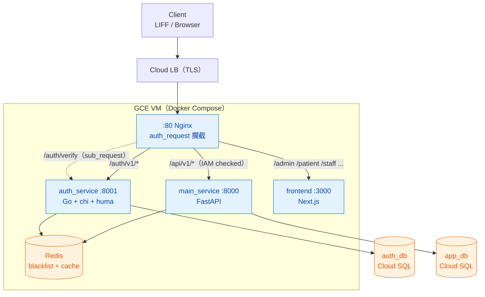
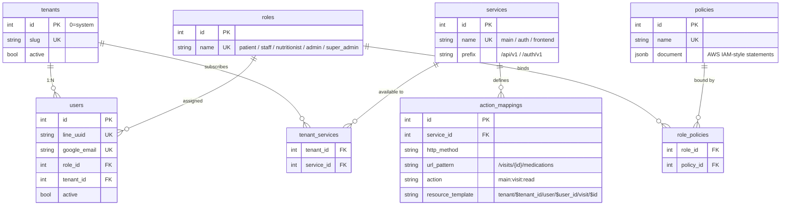
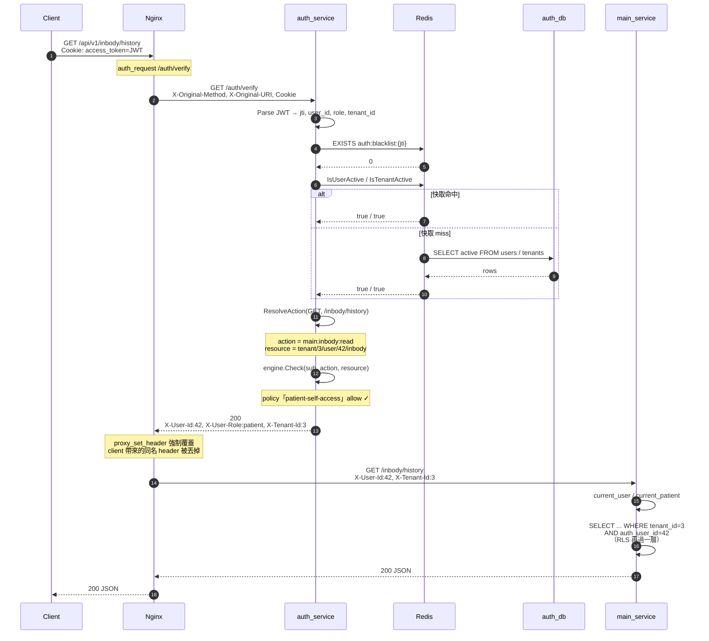
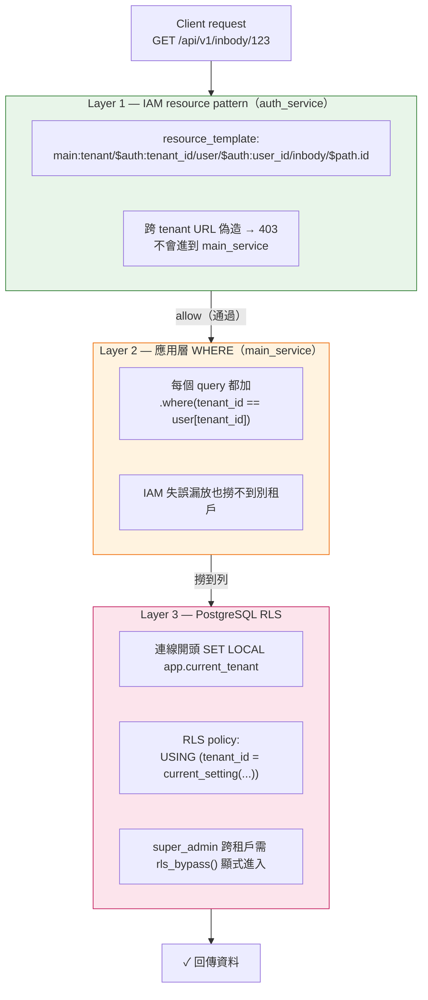

# bye-weight 技術架構分析

> LINE 醫療病患追蹤平台 MVP
> 分析範圍：服務拆分、各服務職責、權限設計、多租戶隔離
> 對應原始規格：[`docs/architecture.md`](./architecture.md)

LINE 醫療病患追蹤平台 MVP，**前後端分離 + Auth 微服務 + Nginx auth_request 攔截 + AWS IAM 風格授權 + 多租戶 Hard isolation**。三個服務跑在單一 VM 的 Docker Compose 裡。

---

## 1. 服務拆分總覽

```
┌──────────── Cloudflare → GCP LB(TLS) ────────────┐
│                                                  │
│  Nginx :80  ────────── auth_request ──────────┐  │
│   ├ /auth/v1/*        → auth_service          │  │
│   ├ /auth/v1/admin/*  → auth_service (擋登入)  │  │
│   ├ /api/v1/*         → main_service (擋 IAM)  │  │
│   ├ /admin/*          → frontend (僅檢登入+role)│ │
│   ├ /patient|staff|.. → frontend (僅檢登入)    │  │
│   └ /                 → frontend              │  │
│                                               ▼  │
│  auth_service  Go + chi + huma   :8001 → auth_db │
│  main_service  FastAPI + asyncpg :8000 → app_db  │
│  frontend      Next.js 14         :3000          │
│  redis         JWT blacklist + cache             │
│                                                  │
└──────────────── Cloud SQL (1 instance, 2 DB) ────┘
```



四個 deployable unit，各自的職責切得很乾淨：

| 服務 | 語言 / 框架 | 主職責 | 不該做的事 |
|---|---|---|---|
| `nginx` | Nginx alpine | 反向代理 + `auth_request` 攔截 | 任何業務或授權邏輯 |
| `auth_service` | Go 1.25 + chi + huma | **唯一**做 identity/authz 判斷的地方；JWT 簽發/驗證;Admin 後台 API | 業務 CRUD |
| `main_service` | FastAPI 0.110 + SQLAlchemy 2.0 async | 病患 / InBody / 飲食 / 看診 / 通知 業務 | 解 JWT、做授權判斷 |
| `frontend` | Next.js 14 App Router | LIFF 橋接、角色分區頁面 | 持有 JWT(HttpOnly cookie) |

**關鍵設計**:`main_service` 完全不解 JWT、不查 policy。它只從 nginx 傳進來的三個 generic header 讀身份,再做 tenant defense-in-depth。

---

## 2. Auth Service(Go) — IAM-style 授權引擎

### 2.1 模型(`auth_db`)

從原本的 RBAC/PBAC 兩階段改為 **AWS IAM 風格**(migration `000002_iam`,後續 23 份 migration 都在補 endpoint):

```
tenants ───┬─── users(tenant_id) ── roles
           │                          │
           └─── tenant_services       │
                     │                ▼
                services ── action_mappings(method, url_pattern → action, resource_template)
                                                                          │
                                                                          ▼
                                                              policies(JSONB document)
                                                                          │
                                                                  role_policies
```



- `tenants.id = 0` 保留給 system tenant(super_admin 專用);其他自增
- `users` 只留 identity(line_uuid / google_email / password_hash / role_id / tenant_id),**領域欄位被砍光**
- `auth_identities`(migration 0021 加的)把 LINE / Google / password 三種登入方式從 users 表分離出去
- `policies.document` 是 JSONB,schema 跟 AWS IAM 一致:`{ statements: [{ effect, actions, resources, conditions }] }`
- `action_mappings`:HTTP `(method, url_pattern)` → `(action, resource_template)`;URL pattern 支援 `{id}` 與尾端 `/*`,resource template 支援 `${auth:user_id}` / `${auth:tenant_id}` / `${path.id}` 變數替換

### 2.2 授權引擎核心(`engine/engine.go`)

兩段式判斷:

1. **`ResolveAction(method, uri)`** — 從快取的 action_mappings 找 regex match,回 `(action, resourceTemplate, pathAttrs, serviceName)`。沒對應規則 → implicit deny。Mapping 依「字面段數」排序,避免 `/visits` 搶到 `/visits/{id}/medications`。
2. **`Check(sub, action, resource)`** — 把 `${auth:*}` / `${path.*}` 展開後,glob match policy statements;遵循 **explicit deny > allow > implicit deny**。

兩份額外 in-memory 快取(5 分鐘 ticker + Redis 共享 + admin 改完可 `/admin/invalidate` 強刷):
- `rolePolicies[role] → []PolicyDocument`
- `tenantServices[tenant] → set<serviceName>`(tenant 必須訂閱 service 才能用,system tenant 永遠視為全訂)

### 2.3 Verify 流程(`handler/verify.go`) — nginx auth_request 真正的執行路徑

```
cookie(access_token)
  → token.Parse              // 簽名 + exp
  → IsRevoked                // Redis auth:blacklist:{jti}
  → IsUserActive             // 後台 disable 立即生效(Redis miss 才打 DB)
  → IsTenantActive           // 租戶停用 → 全租戶 session 失效
  → IsUserRevoked            // admin 拔綁定/改角色,iat < revoked_at 視為失效
  → ResolveAction(method, uri)
  → IsServiceEnabled(tenant, service)
  → SubstituteResource(template, sub, pathAttrs)
  → engine.Check(sub, action, resource)
  → 200 + 注入 X-User-Id / X-User-Role / X-Tenant-Id
```



另有 `VerifyPage`(給 nginx 在前端頁面用),**只檢登入態**、不跑 action mapping,因為頁面路由不適合算具體權限。

### 2.4 Predefined Policies(migration `000002_iam` seed)

| Policy | 綁定角色 | 允許 actions | resource 範圍 |
|---|---|---|---|
| `patient-self-access` | patient | `food_log:*` / `inbody:read` / `visit:read` / `notification:*` / `upload:write` | `tenant/{T}/user/{U}/*`(**只能存取自己**) |
| `staff-clinic-ops` | staff | `inbody:*` / `food_log:read` / `visit:*` / `patient:read` / `upload:write` | `tenant/{T}/*` |
| `nutritionist-ops` | nutritionist | `push:send` / `food_log:read` / `inbody:*` / `notification:write` / `patient:read` | `tenant/{T}/*` |
| `clinic-admin` | admin | `patient:*` / `inbody:*` / `food_log:*` / `visit:*` / `notification:*` / `push:*` / `upload:write` | `tenant/{T}/*` |
| `super-admin-all` | super_admin | `*` | `*` |

**這套設計的精華**:role policy 把 `${auth:tenant_id}` 寫進 resource pattern → tenant 隔離由 IAM 引擎自動做掉,業務層只是 defense-in-depth。新增服務 = 在 `services` + `action_mappings` 加 row,policy 不用改。

### 2.5 JWT 設計

```json
{ "user_id": 42, "role": "patient", "tenant_id": 3, "jti": "uuid", "exp": 1700000000, "iat": 1699999100, "type": "access" }
```

**領域欄位(patient_id / clinic_id)完全不在 JWT 裡** — 下游服務透過 `X-User-Id + X-Tenant-Id` 自己查身份映射表(`patients.auth_user_id`)。這讓 JWT 對 schema 變動完全不敏感。

### 2.6 服務介面(main.go 註冊)

`/auth/verify`、`/auth/verify-page` 走 chi(不進 OpenAPI),其餘對外 / admin API 全走 **huma v2** 自動產 OpenAPI spec:
- **登入**:`/line-token` / `/google` / `/password-login` / `/refresh` / `/logout`
- **綁定**:`/line-bind` / `/google-bind` / `/line-friendship-check`
- **身份**:`/me` / `/me/permissions`(給前端 UI gating 用,回傳所有 allow actions)
- **Admin**(`/admin/*`):users / roles / policies / tenants / services / action-mappings / tenant_services / tenant_roles CRUD

---

## 3. Main Service(FastAPI) — 純業務層

### 3.1 結構(`main.py`)

```
9 routers: health / patients / inbody / food_logs / visits / notifications
         / line_webhook / upload / patient_goals
```

### 3.2 解耦設計(`deps.py`)

只有兩個 dependency:
- `current_user`:讀 `X-User-Id / X-User-Role / X-Tenant-Id` header → dict
- `current_patient`:用 `auth_user_id + tenant_id` 查出當前 user 的 patient profile(給 role=patient 用)

**所有授權判斷已經在 auth_service 做完**。這裡只負責:
1. 身份映射(auth user → patient profile)
2. **Tenant defense-in-depth**:每個 query 都加 `tenant_id == user["tenant_id"]` WHERE
3. RLS 補強:`alembic/0003_rls` 開了 PostgreSQL Row-Level Security,連線時 `SET LOCAL ROLE app_user` + `app.current_tenant`,跨租戶查詢需明確 `rls_bypass()` context manager(僅 super_admin)



### 3.3 路由分層範例(`routers/inbody.py`)

同一個 router 服務三類使用者,靠 IAM resource pattern 自然分流:
- `GET /inbody/history` / `GET /inbody/me/summary` → 病患自己(resource = `user/{auth_user_id}/inbody`,policy 自動限本人)
- `GET /inbody/records` / `GET /inbody/pending/*` → admin / nutritionist(resource = `tenant/{T}/*`)
- `super_admin` 可傳 `all_tenants=true` → 進 `rls_bypass()` 跨租戶讀

### 3.4 資料 schema(`app_db`,10 張)

```
patients(auth_user_id UNIQUE, tenant_id) ─┬─ line_bindings
                                          ├─ visits ── medications
                                          ├─ inbody_records / inbody_pending
                                          ├─ food_logs (JSONB food_items)
                                          ├─ notification_rules / notification_logs
                                          └─ patient_goals (migration 0005~0010 補的)
employees(line_uuid, clinic_id, role)
```

所有業務表都帶 `tenant_id NOT NULL DEFAULT 0`,加上 4+2 套稽核欄位(`created/updated/deleted_*`),由 `audit_autofill()` trigger 從 `app.current_user` session var 自動填。

---

## 4. Frontend(Next.js 14) — 四角色分區

```
src/app/
  liff/           LINE LIFF 入口,liff.getAccessToken() → POST /auth/v1/line-token
  patient/*       病患(LIFF cookie 登入)
  staff/*         診所員工(LIFF cookie 登入)
  nutritionist/*  營養師(LIFF cookie 登入)
  admin/*         super_admin / clinic-admin(Google OAuth + password)
  forbidden       403 落地頁
```

`lib/api.ts` 封裝 `fetchAPI`:自動帶 cookie、401 時 `POST /auth/v1/refresh` 重試,仍失敗才導 LIFF。**JS 完全讀不到 JWT**(HttpOnly cookie)。

Nginx 對前端頁面有兩種把關:
- `/admin/*`:用 `/auth/verify` 攔(會跑 action mapping,要 `ui:admin:view` 權限),未登入 302 `/admin/login`,403 顯示客製化訊息
- `/patient|staff|nutritionist/*`:用 `/auth/verify-page` 輕量檢登入,未登入 302 `/liff`
- `/admin/login`、`/admin/bind-google`:完全不擋

---

## 5. 權限設計關鍵抉擇

| 抉擇 | 取捨 |
|---|---|
| **AWS IAM 風格 over 純 RBAC** | resource ARN 帶變數可表達「自己存自己」「同 tenant」「全部」一致語法;多上一層學習成本,但新功能加 mapping 不用改程式 |
| **JWT 只放 identity** | 角色 / tenant 變更需 invalidate session 才生效(Redis user-revoke flag 補上);換來 schema 不綁 JWT |
| **Nginx auth_request 同步攔截** | 每 request 多一個 hop(latency),但 main_service 完全乾淨;in-memory + Redis 雙層快取 5min TTL 把擊穿減到極小 |
| **Tenant Hard isolation(每張業務表 tenant_id)** | schema 比 single-tenant 重,但跨租戶資料絕對隔離 + RLS + IAM resource pattern 三層擋;MVP 可接受 |
| **領域層仍做 `tenant_id ==` 過濾** | IAM 已擋掉 99%,但 URL 偽造 + 變數替換邏輯 bug 都可能漏;defense-in-depth |
| **`super_admin` 跨 tenant 用 `rls_bypass()` 顯式進入** | 預設 RLS 鎖死,跨 tenant 操作必須是「刻意」 |

---

## 6. 觀察到的可注意點(非 blocker)

- **`X-Original-Method` 由 nginx 額外加**(架構文件原版只有 `X-Original-URI`) — 否則 verify 拿不到 method,會解錯 action。實際 `nginx.conf` 已處理。
- **action_mapping URL 比對用「字面段數」排序** — 對 MVP 規模 OK,patterns 多了之後 collision 風險要回頭看。
- **policy 寫死在 SQL migration seed** — 後期已陸續開出 admin API CRUD(migration 0006、0017),但 super_admin policy 是 `*:*` wildcard,沒有「不能改自己 policy」的 guard,營運上要靠流程。
- **frontend 路由保護重複攔截兩次**(nginx + middleware) — 但 nginx 用 `/auth/verify-page` 而非 `/auth/verify`,分得清楚,沒重工。
- **CLAUDE.md / `docs/architecture.md` 提到的 `permissionMap` 寫死在 Go**(§7A.5 example) — 實際實作已完全改成 DB-driven `action_mappings`,那段是「舊版範例」標註,看 code 才正確。

---

## 結論

整體看,這套架構在 MVP 階段做得相當完整:**authz 集中、業務乾淨、多租戶有三層防線、JWT 不綁 schema**。25 份 auth migration + 10 份 main migration 顯示授權模型其實是穩定的,大部分 migration 是新 endpoint 的 action_mapping seed —— 證明這個 IAM model 真的 scalable。
