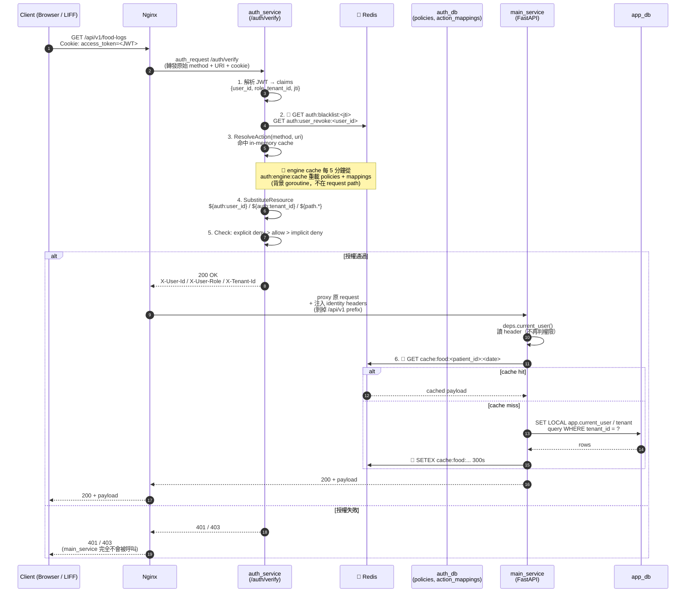
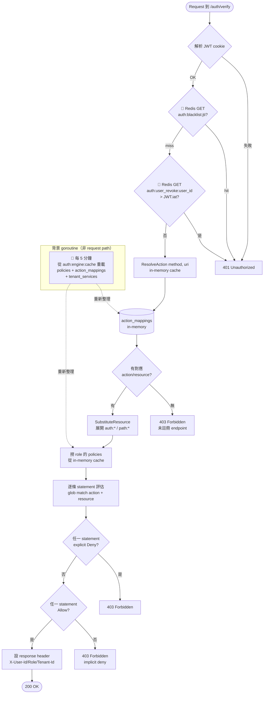

# 認證 / 授權流程圖

> 範圍：business API request（`/api/v1/*`）通過 Nginx → auth_service → main_service 的完整授權鏈，以及 Redis 快取落點。
> 參考實作：`nginx/nginx.conf`、`auth_service/handler/verify.go`、`auth_service/engine/engine.go`、`main_service/deps.py`、`main_service/utils/tenant_guard.py`、`main_service/utils/cache.py`。

---

## 1. 高階流程（端到端）

> 🔴 標記 = Redis 命中點。auth_service 與 main_service 共用同一個 Redis 實例（預設 `redis://localhost:6380/0`）但 key prefix 不同：`auth:*` vs `cache:*`。



---

## 2. auth_service 內部決策細節



---

## 3. 責任切分

| 層級 | 誰負責 | 判斷什麼 | 不做什麼 |
|---|---|---|---|
| **Nginx** | `auth_request` directive | 轉發給 auth_service，失敗直接擋 | 不碰 JWT、不看 policy |
| **auth_service** | `handler/verify.go` + `engine/engine.go` | JWT 有效性、jti blacklist、**IAM policy 決策**（action/resource match、deny/allow）、產生 identity header | 不知道任何業務欄位（`patient_id` / `clinic_id`） |
| **main_service**（deps）| `deps.current_user()` | 純讀 `X-User-Id / X-User-Role / X-Tenant-Id` 還原身份 | **完全不做 role 權限檢查** |
| **main_service**（資料層）| `utils/tenant_guard.py` + 每個 query 顯式帶 `tenant_id` | Hard tenant isolation（defense-in-depth）、`SET LOCAL app.current_user` 讓稽核 trigger 填 `created_by/updated_by` | 不做授權 |

---

## 4. Redis 快取落點總覽

> 所有 Redis 操作共用同一個實例，用 key prefix 切分 namespace：`auth:*` 屬 auth_service，`cache:*` 屬 main_service。

### 4.1 auth_service 側

| # | 用途 | Key pattern | TTL | 寫入 | 讀取 | 說明 |
|---|---|---|---|---|---|---|
| A1 | **JWT 黑名單**（單 token 吊銷） | `auth:blacklist:<jti>` | = JWT exp 剩餘時間 | `token/jwt.go` `Revoke()` | `handler/verify.go` `verifySession()` | 每個 verify 都會查 → **在 request path** |
| A2 | **使用者全局吊銷**（改角色 / 解綁 / 停用） | `auth:user_revoke:<user_id>` | refresh token 最長效期（預設 7d） | `token/jwt.go` `RevokeUser()` | `handler/verify.go` `IsUserRevoked()` | JWT 的 `iat` 早於時戳即失效 |
| A3 | **engine cache**（policies + action_mappings + tenant_services） | `auth:engine:cache` | 5 分鐘 | `engine/engine.go` `saveToCache()` | 背景 goroutine load → in-memory；**不在 request path** | Admin 改 policy 後呼叫 `Invalidate()` 手動刷 |

> ⚠ 重要：A3 是 **Redis + in-memory 雙層**。request path 上只讀 in-memory；Redis 只在啟動和背景刷新時用到。所以單一 request 的授權檢查最多只打 2 次 Redis（A1 + A2）。

### 4.2 main_service 側（業務資料快取）

| # | 用途 | Key pattern | TTL | Invalidate 時機 | 檔案 |
|---|---|---|---|---|---|
| M1 | Food logs（按日期分片） | `cache:food:<patient_id>:<date_YYYY-MM-DD>` | 300s | 寫入新食物日誌後 | `routers/food_logs.py` |
| M2 | InBody 紀錄 | `cache:inbody:<patient_id>` | 300s | 新增 / resolve pending 後 | `routers/inbody.py` |
| M3 | 通知規則 | `cache:notif_rules:<patient_id>` | 300s | 建立 / 更新規則後 | `routers/notifications.py` |

> Invalidation 原則：**寫入端主動 `DEL`**，不靠 TTL 等過期。讀取端永遠先查 cache，miss 才打 DB 並回填。

### 4.3 初始化位置

- auth_service：`store/redis.go` — `REDIS_URL` env（預設 `redis://localhost:6380/0`），`main.go` 啟動時注入 engine & handler
- main_service：`utils/cache.py` — 同一個 `REDIS_URL`，匯出 `redis_client` 全域物件給各 router

---

## 5. 效能瓶頸分析

> 以下排序依 **每個 `/api/*` request 實際付出的成本** 由高到低。冷啟動（startup load）、5 分鐘背景刷新都不算在 request path 上，單獨列在最後。

### 🔴 High — 每個 request 都會打的遠端 I/O

**B1. auth_service 每次 verify 打 2 次 auth_db**（`handler/verify.go:30-43`）

```go
SELECT active FROM users WHERE id = $1       -- 每個 request
SELECT active FROM tenants WHERE id = $1     -- 每個 request（system tenant 跳過）
```

這兩個 query **完全沒有快取**。每個 `/api/*` 都要等 Cloud SQL 回覆才能繼續，等同於把 auth_db 的 p99 latency 疊到所有 API p99 上。是整條 chain 裡最嚴重的熱點。

- 影響：auth_db 故障 / 慢 → 全部 API 跟著慢 / 失敗
- 改善方向：
  - 把 `user.active` / `tenant.active` 加到 Redis（短 TTL 例如 30s，admin 停用時主動 `DEL`）
  - 或改成「停用時寫 `auth:user_revoke:<id>`」，讓現有 user_revoke 機制順便涵蓋 active flag，就不用再打 DB

**B2. auth_service 每次 verify 打 2 次 Redis**（`token/jwt.go` `IsRevoked` / `IsUserRevoked`）

- `GET auth:blacklist:<jti>` + `GET auth:user_revoke:<user_id>`
- fail-closed：Redis 故障 → 503，全部 API 一起掛
- 影響比 B1 小（同機房 Redis < 1ms），但仍是每 request 兩次網路 round-trip
- 改善方向：用 `MGET` 合併成一次；或接受單點風險換低延遲

**B3. Nginx `auth_request` 是同步序列化**（`nginx/nginx.conf:87`）

- 每個 `/api/*` 必須等 auth_service 回應才能 proxy 給 main_service
- auth_service 慢 = 整條 chain 慢；latency 是 `T(auth_service) + T(main_service)` 不是 max
- 這是設計取捨，要靠 B1/B2 優化把 T(auth_service) 壓低

### 🟡 Medium — 每個 request 固定但可接受的 overhead

**B4. main_service 每個 tx 開頭執行 3 次 SET LOCAL**（`database.py:41-59`）

```sql
SET LOCAL ROLE app_user;
SELECT set_config('app.current_tenant', ..., true);
SELECT set_config('app.current_user', ..., true);
```

- 為了 RLS + audit trigger 一定要做，只能減不能砍
- 影響：每個 request 多 3 個 round-trip 到 app_db
- 改善方向：包成 single statement（`DO $$ … $$`），或靠連線 pooling 的 `session_reset` 只在必要時跑

**B5. Python tenant_guard event listener**（`main_service/utils/tenant_guard.py`）

- 每個 SELECT / UPDATE / DELETE 都要 parse SQL 找 `tenant_id` 條件
- 如果用 SQLAlchemy Core 動態組 query，check 成本疊上去；純 ORM 用 `Patient.tenant_id == ...` 相對便宜
- 是 defense-in-depth，不建議砍；但熱路徑 endpoint 若量大，可以考慮 per-endpoint disable（信任 auth_service 判斷就好）

**B6. engine.Check 的 policy 評估**（`engine/engine.go:277-302`）

- O(policies × statements × (actions + resources)) 線性掃描
- 目前每個 role 最多 2–3 份 policy，每份 ~5 條 statement → 幾十次字串比對，μs 級
- 真要壓 → 建索引（依 action prefix 分桶）；**目前量還沒到**不用急

**B7. engine.ResolveAction 的 mapping 比對**（`engine/engine.go:258-271`）

- O(mappings) 線性掃 regex match，目前 ~幾十條 → 幾 μs
- 有依 URL 特異度排序，具體 pattern 先命中可 early return

### 🟢 Low — 不算在 request path 上的

**B8. engine cache refresh**（`engine/engine.go:71-79`）

- 背景 goroutine 每 5 分鐘 load DB → write Redis `auth:engine:cache` → 更新 in-memory
- 用 `sync.RWMutex`，refresh 期間會短暫 `Lock()` 阻塞 request 的 `RLock()`，但 load + marshal 只要幾十 ms
- 若 request 量極大可改成 double-buffer swap（構建新副本再 atomic pointer swap）

**B9. JWT HMAC verify**（`token/jwt.go`）

- 純 CPU，sub-ms
- 唯一風險是未來換 RS256（RSA verify 比 HMAC 慢 ~10 倍），到時再評估

**B10. main_service 業務 cache miss**（`cache:food:*` / `cache:inbody:*` / `cache:notif_rules:*`）

- TTL 300s，cache miss 時打 app_db
- **隱憂**：key 沒包 `tenant_id`（`cache:food:<patient_id>:<date>`）。目前 `patient_id` 全域唯一沒事，但若未來 patient_id 改成 per-tenant 就會資料污染。建議預防性改成 `cache:food:t<tenant_id>:<patient_id>:<date>`

---

### 實務優化順序建議

1. **先處理 B1**（快取 `user.active` / `tenant.active`）— 預期吞吐提升最大
2. **順手做 B2**（blacklist + user_revoke 合併 `MGET`）
3. **量測 B4**（如果連線 pool 沒瓶頸就不用動）
4. **其他先不動**，等壓測壓出來再說

---

## 6. 為什麼這樣拆？

- **JWT 刻意瘦身**：只放 `user_id / role / tenant_id`，不放 `patient_id / clinic_id` 這類業務欄位 → token 不會綁死領域資料，身份映射留給下游服務查。
- **授權集中化**：新增一個 main_service endpoint 時，只需要：
  1. 在 `auth_db.action_mappings` 插入一筆 `(service, method, uri_pattern, action, resource_template)`
  2. 視情況寫 / 改一份 policy document（`patient-self-access` / `staff-clinic-ops` / …）
  3. **不用動 main_service 的程式碼** — main_service 只管業務邏輯。
- **雙層防線**：即使 auth_service policy 有漏洞，`tenant_guard` event listener 會在 SQLAlchemy 層攔截沒帶 `tenant_id` 條件的 query，再次擋下跨租戶存取。

---

## 7. 關鍵變數替換語法（policy resource pattern）

| 變數 | 來源 | 範例 |
|---|---|---|
| `${auth:user_id}` | JWT claims.user_id | `main:patient:*:${auth:user_id}` |
| `${auth:tenant_id}` | JWT claims.tenant_id | `main:*:t${auth:tenant_id}:*` |
| `${auth:role}` | JWT claims.role | 少用，多半由 policy assignment 管 |
| `${path.<param>}` | URI pattern 擷取（chi-style）| `GET /patients/{id}` → `${path.id}` |

Policy 評估時先替換再 glob match，所以 `patient-self-access` policy 可以用單一 rule 表達「只能看自己的 patient record」：

```json
{
  "Effect": "Allow",
  "Action": ["main:patient:read"],
  "Resource": ["main:patient:t${auth:tenant_id}:${auth:user_id}"]
}
```

---

## 8. 延伸閱讀

- [`architecture.md`](./architecture.md) — 系統整體架構
- [`ADDING_ENDPOINTS.md`](./ADDING_ENDPOINTS.md) — 新增 endpoint 時的 action_mapping / policy 步驟
- `auth_service/migrations/000002_iam.up.sql` — action_mappings schema + 初始 seed
- `auth_service/migrations/000008_iam_policies.up.sql` — 5 份預設 policy
- `auth_service/store/redis.go` / `auth_service/token/jwt.go` — Redis client 初始化、blacklist / user_revoke 實作
- `auth_service/engine/engine.go` — `auth:engine:cache` 的 5 分鐘刷新邏輯
- `main_service/utils/cache.py` — `cache:*` 讀寫 helper
