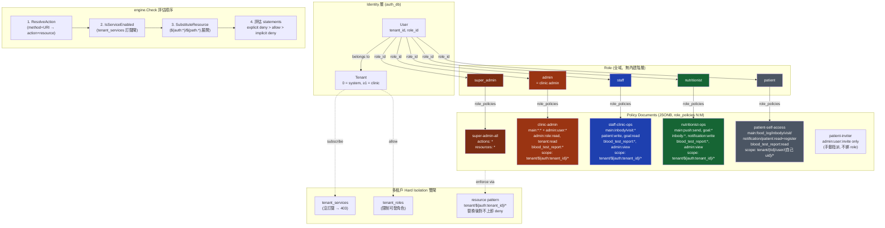

# 權限階層 (Permission Hierarchy)

> 一張圖看懂目前 5 個角色、5 份 policy、tenant 雙閘的關係。
>
> Schema、verify 流程、變數替換語法請見：
> - [`architecture-analysis.md`](./architecture-analysis.md) §2 — Auth Service 模型與 ER 圖
> - [`auth-flow.md`](./auth-flow.md) — JWT verify pipeline 與快取設計
> - [`architecture.md`](./architecture.md) §7A.4 — IAM-style schema 完整定義
> - [`ADDING_ENDPOINTS.md`](./ADDING_ENDPOINTS.md) — 新增 endpoint 時的 action_mapping / policy 步驟

---

## 重要觀念

**不是 RBAC 的階層繼承模型。** Role 只是「policy 的容器」，真正的權限由 policy document（AWS IAM 風格 JSONB）決定。

廣度上看起來像 `super_admin > admin > staff/nutritionist > patient`，但這是各 role 綁的 policy 文件「巧合」呈現出來的，**不是系統強制的繼承**。換掉某個 role 的 policy 綁定，這個階層就會改變。

評估規則（`auth_service/engine/engine.go:277` `Check`）：**explicit deny > allow > implicit deny**。

---

## 主圖：User → Role → Policy → Tenant Gates → Eval



---

## 廣度比較（policy 涵蓋面）

```
super_admin (全宇宙, *:*)
  └─ admin   = clinic-admin   (tenant 內 main:*  +  admin:user:* / role:read / tenant:read)
       ├─ staff        = main 操作（除 patient:delete、push）
       ├─ nutritionist = main 操作（push:send / goal:*；不可 write patient）
       └─ patient      = 只能碰自己 user_id scope 下的資源
```

> ⚠️ 圖中的 ├─ └─ 是「能做的事多寡」上的偏序，**不是繼承關係**。staff 不會自動拿到 patient 的 self-access，admin 也不會自動拿到 patient 角色能做的事。

---

## Role × Policy 綁定 (`role_policies`)

| Role | Policy | Source migration |
|---|---|---|
| `patient` | `patient-self-access` | `000002_iam` → 後續 `000009`、`000011`、`000026` 擴 actions |
| `staff` | `staff-clinic-ops` | `000002_iam` → `000011`/`000012`/`000025`/`000026` 擴 actions |
| `nutritionist` | `nutritionist-ops` | `000002_iam` → `000012`/`000025`/`000026` 擴 actions |
| `admin` | `clinic-admin` | `000002_iam` → `000012`/`000014`/`000016`/`000025`/`000026` 數次重寫 |
| `super_admin` | `super-admin-all` | `000002_iam`（永遠是 `*:*`） |
| _（手動指派）_ | `patient-inviter` | `000015_patient_invite`（只給 `admin:user:invite`） |

每份 policy 的詳細 actions / resources 表請看 [`architecture-analysis.md`](./architecture-analysis.md) §2.4。

---

## Tenant 隔離的兩道閘

兩道閘**獨立生效**——任一道擋下都 403：

1. **訂閱閘 (`tenant_services`)** — Tenant 沒訂該 service → engine 直接 403，不論 policy 寫得多寬
2. **資源閘 (`${auth:tenant_id}` 替換)** — 所有 resource template 帶 `tenant/${auth:tenant_id}/...`；JWT 裡的 tenant_id 替換進去後，跨 tenant 的 ARN 自然對不上 policy 的 resource pattern

額外有 `tenant_roles` 限制「這個 tenant 可以發哪些角色」，但這是**建立 user 時**的閘，不是 request-time 閘。

System tenant (`id=0`) 是 super_admin 專屬，在 `IsServiceEnabled` 視為永遠全訂。

---

## Policy 自管伏筆 (`policies.tenant_id`)

Migration `000018_policy_tenant_scope` 已替 `policies` 加上 `tenant_id` 欄位：

- `tenant_id = 0` — 系統級 policy，所有 tenant 共用，**只有 super_admin 能改**
- `tenant_id > 0` — 預留給未來 clinic-admin 自管自家 tenant policy（Phase 2b 才會開 CRUD endpoint）

目前 6 份 policy 都還是 `tenant_id = 0`。

---

## 一句話總結

**Role 5 種、Tenant hard isolation、AWS IAM-style policy document (JSONB)，權限粒度由 policy 決定而不是 role 寫死；`super_admin` 不在階層裡，而是 `tenant=0` + 萬用 `*:*` 給出來的特權。**
